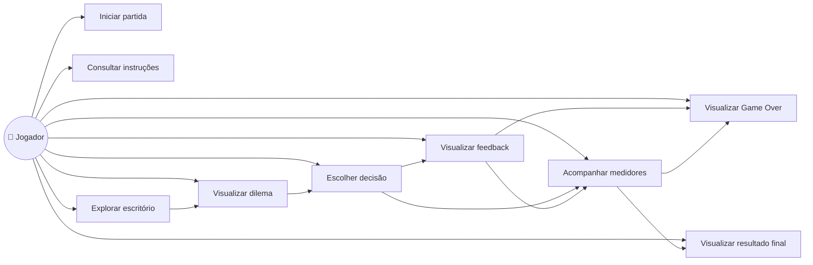
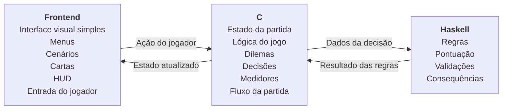

# Decifra.IA — FDS Unidade 1

> **Requisitos Funcionais, Requisitos Não Funcionais, Casos de Uso e Esboço de Arquitetura**

> Projeto Integrador — Squad 8 | CESAR School | 2026.2

---

## 1. Requisitos Funcionais (RF)


| ID | Requisito | Descrição | Prioridade |
|:--:|-----------|-----------|:----------:|
| `RF01` | **Menu principal** | O sistema deve apresentar um menu principal com as opções de iniciar o jogo, consultar instruções e sair. |  Must Have |
| `RF02` | **Iniciar partida** | O sistema deve permitir que o jogador inicie uma nova partida. |  Must Have |
| `RF03` | **Explorar escritório** | O jogador deve poder explorar o primeiro escritório da fase de Estagiário. |  Must Have |
| `RF04` | **Apresentar dilemas** | O sistema deve apresentar cenários de decisão relacionados aos pilares de viés, alucinação, privacidade e dependência. |  Must Have |
| `RF05` | **Escolher decisão** | O jogador deve poder escolher entre duas alternativas diante de cada dilema. |  Must Have |
| `RF06` | **Atualizar medidores** | Após cada decisão, o sistema deve atualizar os medidores de confiança, privacidade, lucro e viés. |  Must Have |
| `RF07` | **Exibir feedback** | O sistema deve apresentar um feedback explicativo sobre a consequência da decisão escolhida. |  Must Have |
| `RF08` | **Controlar pontuação** | O sistema deve manter a pontuação acumulada durante a partida. |  Must Have |
| `RF09` | **Verificar Game Over** | O sistema deve verificar os medidores após cada decisão e encerrar a partida caso algum deles atinja uma condição de Game Over. |  Must Have |
| `RF10` | **Exibir resultado final** | Ao concluir a partida, o sistema deve apresentar a pontuação final do jogador. |  Should Have |

---

## 2. Requisitos Não Funcionais (RNF)


| ID | Categoria | Requisito |
|:--:|-----------|-----------|
| `RNF01` | **"Execução"** | O sistema deve compilar e executar sem erros. |
| `RNF02` | **"Interface"** | O jogo deve possuir uma interface visual simples para apresentação das informações e interação com o jogador. |
| `RNF03` | **"Tecnologias"** | A solução deve utilizar **C** e **Haskell**, respeitando a separação de responsabilidades definida na arquitetura. |
| `RNF04`| **"Modularidade"** | Os componentes devem possuir responsabilidades separadas, evitando concentrar interface, estado e regras em um único módulo. |
| `RNF05`| **"Consistência"** | As mesmas decisões, considerando o mesmo estado, devem produzir resultados consistentes de acordo com as regras definidas. |
| `RNF06`| **"Testabilidade"** | As principais regras e comportamentos do sistema devem poder ser testados de forma independente. |
| `RNF07`| **"Conteúdo educativo"** | A Unidade 1 deve abordar os quatro pilares definidos para o jogo: viés, alucinação, privacidade e dependência. |
| `RNF08`|**"Escopo técnico"** |: A solução não deve utilizar banco de dados, multiplayer, IA generativa/real ou engine de jogos. |

---

## 3.  Diagrama de Casos de Uso

> Ator principal: **"Jogador"**



### 3.1. Descrição dos Casos de Uso

<details>
<summary><b>UC01 — "Iniciar partida"</b></summary>

- **Ator:** Jogador
- **Descrição:** O jogador seleciona a opção para iniciar uma nova partida.
- **Resultado:** O sistema inicializa a partida e apresenta a fase de Estagiário.
</details>

<details>
<summary><b>UC02 — "Consultar instruções"</b></summary>

- **Ator:** Jogador
- **Descrição:** O jogador acessa as instruções do jogo.
- **Resultado:** O sistema apresenta as informações necessárias para compreender a mecânica e o objetivo da partida.
</details>

<details>
<summary><b>UC03 — "Explorar escritório"</b></summary>

- **Ator:** Jogador
- **Descrição:** O jogador explora o primeiro escritório da fase de Estagiário e interage com os elementos disponíveis.
- **Resultado:** O jogador encontra os pontos de interação que apresentam os dilemas.
</details>

<details>
<summary><b>UC04 — "Visualizar dilema"</b></summary>

- **Ator:** Jogador
- **Descrição:** O sistema apresenta um cenário relacionado a um dos pilares educativos do jogo.
- **Resultado:** O jogador recebe as informações necessárias para tomar uma decisão.
</details>

<details>
<summary><b>UC05 — "Escolher decisão"</b></summary>

- **Ator:** Jogador
- **Descrição:** O jogador escolhe uma das duas alternativas disponíveis para o dilema.
- **Resultado:** A decisão é enviada para o processamento da lógica do jogo.
</details>

<details>
<summary><b>UC06 — "Visualizar feedback"</b></summary>

- **Ator:** Jogador
- **Descrição:** Após a decisão, o sistema apresenta uma explicação sobre suas consequências.
- **Resultado:** O jogador compreende o impacto da decisão tomada.
</details>

<details>
<summary><b>UC07 — "Acompanhar medidores"</b></summary>

- **Ator:** Jogador
- **Descrição:** O sistema apresenta os valores atuais dos quatro medidores:
  - `Confiança`
  - `Privacidade`
  - `Lucro`
  - `Viés`
- **Resultado:** O jogador consegue acompanhar como suas decisões estão afetando a partida.
</details>

<details>
<summary><b>UC08 — "Visualizar Game Over"</b></summary>

- **Ator:** Jogador
- **Descrição:** Quando um dos medidores atingir uma condição de Game Over, o sistema encerra a partida e apresenta a causa.
- **Resultado:** O jogador recebe a informação sobre o motivo do encerramento.
</details>

<details>
<summary><b>UC09 — "Visualizar resultado final"</b></summary>

- **Ator:** Jogador
- **Descrição:** Ao concluir a partida, o sistema apresenta o resultado final.
- **Resultado:** O jogador visualiza sua pontuação final.
</details>

---

## 4. Esboço de Arquitetura

A solução será organizada em três componentes principais:

1. **"Frontend"**
2. **"C"**
3. **"Haskell"**

> O **frontend** será responsável pela apresentação visual e interação com o jogador. O **C** será responsável pelo estado e pela lógica principal da partida. O **Haskell** será responsável pelas regras, pontuação e validações.
>
> A interface visual será simples e **não** utilizará uma engine de jogos.



### 4.1. "Frontend"

> Responsável pela apresentação visual do jogo e pela interação com o jogador.

**Responsabilidades:**
- Exibir menus
- Apresentar o escritório/cenário
- Exibir o personagem e elementos visuais necessários
- Apresentar os dilemas
- Apresentar as opções de decisão
- Capturar a escolha do jogador
- Exibir os quatro medidores
- Exibir feedback
- Exibir mensagens de Game Over
- Exibir o resultado final


### 4.2. "C"

> Responsável pelo estado e pela lógica principal da partida.

**Responsabilidades:**
- Gerenciar o estado atual da partida
- Controlar os cenários
- Receber as decisões realizadas pelo jogador
- Processar as decisões
- Atualizar os medidores
- Controlar a sequência dos desafios
- Verificar as condições de Game Over
- Manter a pontuação durante a partida
- Solicitar ao Haskell o processamento das regras necessárias

### 4.3. "Haskell"

> Responsável pelas regras e cálculos do jogo.

**Responsabilidades:**
- Implementar regras relacionadas às decisões
- Calcular pontuação
- Determinar consequências das escolhas
- Realizar validações relacionadas às regras

> A lógica de regras será mantida separada da interface visual e do gerenciamento do estado da partida.

---

## 5. Integração entre os Componentes

> Fluxo geral de comunicação entre os componentes:

```
Jogador
   ↓
Frontend
   ↓
Ação do jogador
   ↓
C
   ↓
Processamento da decisão
   ↓
Haskell
   ↓
Resultado das regras
   ↓
C
   ↓
Estado atualizado
   ↓
Frontend
   ↓
Atualização da interface
```

### "Exemplo de funcionamento"

1. O jogador visualiza um dilema no **frontend**.
2. O jogador seleciona uma das alternativas.
3. O **frontend** envia a decisão para o **C**.
4. O **C** identifica o cenário e processa a decisão.
5. O **C** utiliza as funções de regras implementadas em **Haskell** quando necessário.
6. O **Haskell** retorna o resultado do processamento.
7. O **C** atualiza o estado da partida e os medidores.
8. O **frontend** apresenta o novo estado e o feedback ao jogador.

---

## 6.  Separação de Responsabilidades

| Componente | Responsabilidade |
|:----------:|-------------------|
| **"Frontend"** | Interface visual, apresentação dos elementos do jogo e interação com o jogador |
| **"C"** | Estado da partida e lógica principal do jogo |
| **"Haskell"** | Regras, pontuação e validações |

> Essa separação permite que a interface visual não fique diretamente responsável pelas regras do jogo, enquanto C e Haskell concentram a lógica necessária para o funcionamento da partida.

---
